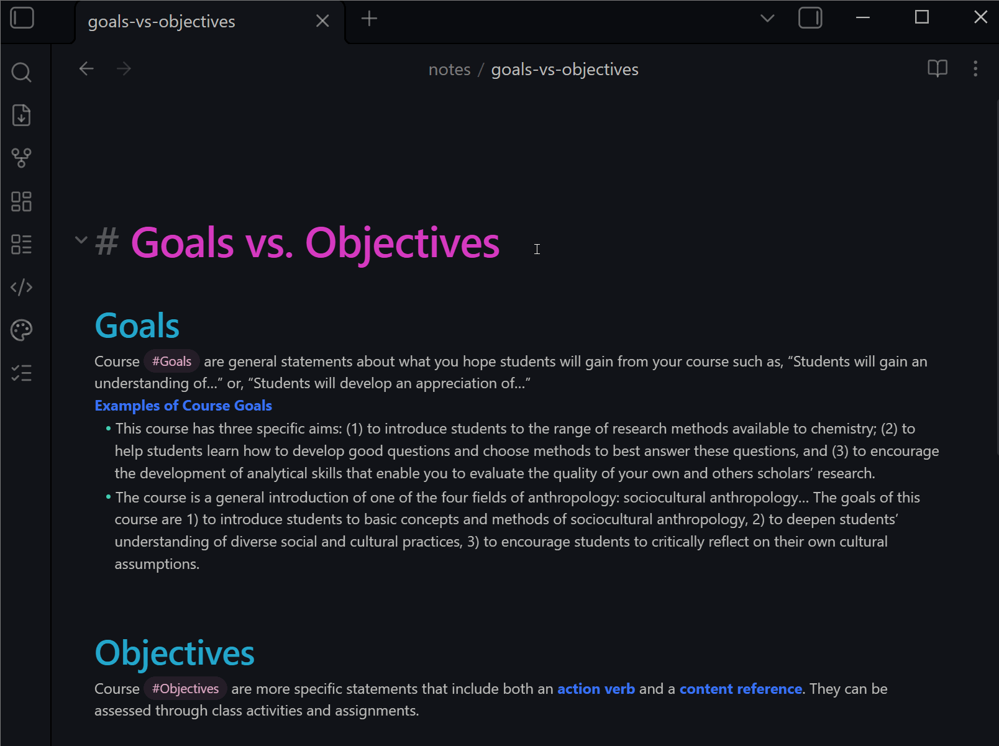

# Schematter

Enforce and populate Obsidian note frontmatter using a **local** LLM (Ollama or any
OpenAI-compatible server). You define a frontmatter schema in the plugin settings; the
plugin sends that schema to your local model, validates the model's JSON response against
the schema, and writes the result back into the note's frontmatter.

Nothing leaves your machine: the plugin only talks to the local endpoint you configure.

> **Personal project:** This repository is shared publicly but is not actively maintained for external contributors. Pull requests and issues may not receive a response. See [CONTRIBUTING.md](CONTRIBUTING.md) for details.



---

## Why

Frontmatter is useful — until maintaining it becomes the work.

I kept finding myself carefully typing YAML instead of actually thinking. Tagging, categorizing, filling in fields — it feels productive, but it isn't. The note is already written. The idea is already there. Reaching for the frontmatter block at that point is a way of avoiding the harder things: synthesizing, connecting, committing an opinion to the page.

Schematter gets frontmatter out of the way. Define your schema once, point the plugin at a local model, and let it fill in the rest. You review the result in seconds and move on.

No API keys. No data leaving your machine. No subscription.

---

## What it does

1. You run the **Enforce Frontmatter** command on an open Markdown note.
2. The plugin reads the note body and its existing frontmatter.
3. It builds a prompt describing your configured schema and sends it to your local LLM,
   along with a machine-enforceable JSON Schema.
4. The model returns a JSON object.
5. The plugin extracts and validates that JSON against your schema, normalizes a few
   common quirks (e.g. dates), and merges it into the note's frontmatter.
6. Optionally, a **preview dialog** shows the proposed changes before anything is written.

---

## Installation

Schematter is not yet listed in the Obsidian community plugins directory. Install it manually:

1. Go to the [latest release](https://github.com/johntgalaxy/obsidian-schematter/releases/latest).
2. Download **`obsidian-schematter.zip`** from the release assets.
3. Unzip it — this produces a folder named `obsidian-schematter/`.
4. Move that folder into your vault's `.obsidian/plugins/` directory.
5. In Obsidian, go to **Settings → Community Plugins**, enable community plugins if prompted, then enable **Schematter**.

---

## Quick start

1. Install and enable the plugin.
2. Start your local LLM server:
   - **Ollama**: runs at `http://localhost:11434` by default. Endpoint: `http://localhost:11434/api/chat`.
   - **OpenAI-compatible** (LM Studio, llama.cpp server, vLLM, etc.): endpoint typically
     `http://localhost:1234/v1/chat/completions`.
3. Open the plugin settings and choose your **Provider**, **Endpoint URL**, and **Model name**.
4. (Optional) Review the **Frontmatter Properties** section and adjust the properties you want managed.
5. Open a Markdown note and run **Enforce Frontmatter** from the command palette.
   You can also run **Enforce Frontmatter (no preview)** or
   **Enforce Frontmatter (force preview)** to override the preview setting for
   that run.

---

## Command palette

- **Enforce Frontmatter** updates the active Markdown note using your preview setting.
- **Enforce Frontmatter (no preview)** updates the active note without the normal preview.
  Cleanup mode still previews removals.
- **Enforce Frontmatter (force preview)** previews the active note before writing.
- **Validate Frontmatter** checks the active note's existing managed frontmatter
  against your schema without calling the model or writing changes.
- **Infer Schema from Active Note** previews frontmatter properties inferred from the
  active note's frontmatter and can merge new properties or replace your schema.
- **Apply configured title actions** runs the enabled title rename/heading actions on the
  active note without calling the model.
- **Rename file from title** renames the active note from its configured title value without
  calling the model, even if automatic renaming is off.
- **Write title heading** inserts or updates the active note's first Markdown heading from
  its configured title value without calling the model, even if automatic heading writes are off.
- **Enforce Frontmatter for All Notes in Active Folder** processes every Markdown
  note in the active note's folder and its subfolders, except excluded paths/folders.
- **Enforce Frontmatter for All Notes in Vault** processes every Markdown note in the vault,
  except excluded paths/folders.

Batch commands run with up to **Batch concurrency** notes active at once, show a
confirmation/progress modal, allow cancellation after active notes finish or time out, skip
per-note previews, and finish with a succeeded / skipped / failed report. If unknown keys
are not preserved, the batch modal warns before starting.

---

## Settings reference

Use **Provider connection** in settings to send a tiny test request and report
success/failure, latency, and the accepted response format mode.

| Setting | What it controls |
| --- | --- |
| **Provider** | `Ollama` or `OpenAI-compatible`. Determines the request/response format and how the schema is enforced. |
| **Endpoint URL** | The HTTP endpoint of your local server. Auto-fills a sensible default per provider. |
| **Model name** | The model identifier passed to the server (e.g. `llama3`). |
| **Temperature** | `0`–`2`. Lower is more deterministic; `0` is recommended for classification. |
| **Preview before apply** | Show a diff dialog before writing changes. |
| **Create backup before write** | Save a `.bak` snapshot before frontmatter or title actions change a note. |
| **Backup folder** | Vault folder where pre-write snapshots are stored. |
| **Preserve all unknown frontmatter keys** | When on, keys that are not enabled frontmatter properties are left untouched. When off, unknown keys are removed unless listed in **Preserve specific unknown keys** (a removal preview is always shown in this mode). |
| **Preserve specific unknown keys** | Comma- or newline-separated unknown frontmatter keys to keep during cleanup mode, such as `aliases` or `cssclasses`. Leave empty to remove all unknown keys. |
| **Exclude paths from batch enforcement** | Comma- or newline-separated vault path/glob patterns skipped by folder/vault batch commands, such as `**/*.excalidraw.md`. |
| **Exclude folders from batch enforcement** | Comma- or newline-separated vault folders skipped by folder/vault batch commands. Defaults skip `Excalidraw/` and `Canvas/`. |
| **Title source YAML key** | Frontmatter YAML key used for title actions. Defaults to `title`. |
| **Rename file from title** | Rename the note file after frontmatter is written, using the generated title value. |
| **Filename case** | Optional title cleanup for renamed files: `None`, `Title Case`, `Sentence case`, `lowercase`, `kebab-case`, `snake_case`, or `PascalCase`. Invalid filename characters are sanitized after this step. |
| **Write title heading** | Insert or update the first Markdown heading from the generated title value. |
| **Title heading level** | Markdown heading level, `H1` through `H6`, used by Write title heading. |
| **Title Case preserve words** | Words whose configured casing is preserved when Filename case or Title heading case is `Title Case`, such as `iOS` or `JavaScript`. |
| **Title Case lowercase words** | Words kept lowercase when Filename case or Title heading case is `Title Case`, such as `a`, `an`, `and`, or `or`. |
| **Max note characters sent** | Long notes are truncated before being sent to the model. |
| **Request timeout seconds** | How long to wait before treating a request as failed. |
| **Date timezone** | Whether file/current timestamps are converted to dates using local time or UTC. |
| **Date write mode** | Write managed dates as quoted `YYYY-MM-DD` strings or unquoted native YAML date scalars. |
| **Batch concurrency** | How many notes folder/vault enforcement may process at once. |
| **Batch note timeout seconds** | How long one note may run during folder/vault enforcement before it is marked failed. |
| **Frontmatter Properties** | The frontmatter properties this plugin manages (see below). |

---

## Frontmatter Properties

A frontmatter schema is an ordered list of **frontmatter properties**. Each property has:

- **YAML key** — the frontmatter key name (e.g. `type`, `created`).
- **Display label** — a human-readable name used in previews/settings.
- **Aliases** — alternate YAML keys the property might appear under. Aliases are **semantic hints**
  for the model *and* are used to find existing values: if your note already has `category:`
  and `category` is an alias of `type`, the plugin treats that as the existing value of `type`.
  Aliases never create extra YAML keys.
- **Examples** — sample values that guide the model's output style.
- **Description** — prompt guidance describing what the property means / how to fill it.
- **Allowed values note** — optional Markdown note reference whose contents are added to the
  prompt as controlled-vocabulary guidance. Paths, note names, and wikilinks are supported.
  This is useful for long tag lists.
- **Value kind** — how the response is validated: `string`, `list`, `enum`, `enum-list`,
  `number`, `boolean`, or `date`.
- **Value constraints** — optional validation rules for supported kinds: string
  length/pattern, list item counts, enum-list item counts, and number min/max.
- **Value normalizer** — optional for `string` properties. Choose `None`, `Title Case`,
  `Sentence case`, `lowercase`, `kebab-case`, `snake_case`, or `PascalCase` to normalize
  values before frontmatter is written.
- **Required** — whether the model must return this property.
- **Enabled** — disabled properties are not requested, validated, or written.

The default schema ships with `title`, `type`, `subject`, `topic`, `created`, and `modified`.
You can add, remove, reorder, import, and export properties, or **infer** a starting schema
from a pasted YAML frontmatter sample.

For Obsidian's native `tags` frontmatter, click **Add property**, then set
**Property type** to **Obsidian tags** inside the new property card. The card becomes a
compact preset: the plugin fixes the YAML key to `tags`, validates the value as an array
of strings, and shows only the tag vocabulary note selector. Generic aliases, examples,
description, value kind, and required controls are intentionally hidden for this preset.

### Value kinds and validation

| Kind | Accepted output | Notes |
| --- | --- | --- |
| `string` | Any non-empty text | Trimmed; empty strings rejected. Optional value normalization can be enabled per property. |
| `list` | Array of non-empty text values | Useful for custom non-tag arrays. |
| `enum` | One value from your allowed list | Allowed values are trimmed; empty values rejected. |
| `enum-list` | Array of values from your allowed list | Useful for controlled multi-value properties. |
| `number` | A finite number | |
| `boolean` | `true` / `false` | |
| `date` | `YYYY-MM-DD` | Common shapes like ISO datetimes and `June 15, 2026` are normalized to `YYYY-MM-DD` before validation. |

For a custom non-tag array property, use the `list` value kind. For Obsidian tags, use the
dedicated **Obsidian tags** property type.

---

## How schemas are passed to the LLM

This is the core of the plugin. There are **three representations** of your schema, each
serving a different purpose. They are generated from the same property configuration but
shaped differently because the prompt, Ollama, and OpenAI-compatible servers each consume
schemas differently.

### 1. The prompt (human-readable guidance — both providers)

Every request includes a system message and a user message. The system message is:

> You classify Obsidian notes. Return only a JSON object matching the supplied schema. Do
> not include Markdown, comments, or explanations.

The user message contains, in order:

- The list of YAML keys to infer.
- **Property details** — for each enabled property: label, key, value kind, required/optional,
  aliases, examples, allowed enum values, allowed-values note path, a `format: YYYY-MM-DD`
  hint for dates, and the description.
- A **JSON Schema** of your configuration (the rich form, including `description` and
  `format` keywords) for the model to read.
- **Runtime context** — file basename, file created date, current date in the configured date timezone.
- **Existing configured frontmatter** — current values (resolved via YAML keys and aliases) so the
  model can preserve values when your guidance says to.
- **Referenced property notes** — contents of configured allowed-values notes, such as a
  controlled tag vocabulary.
- The (possibly truncated) **note body**.

This prose + JSON-Schema guidance is what steers smaller local models. It is sent regardless
of provider.

### 2. Ollama — the `format` field (server-enforced)

For the **Ollama** provider, the request to `/api/chat` includes a `format` field set to a
JSON Schema. Ollama constrains the model's output to that schema. The body looks like:

```json
{
  "model": "llama3",
  "stream": false,
  "format": {
    "type": "object",
    "properties": {
      "type":  { "type": "string" },
      "subject": { "type": "string" },
      "created": { "type": "string" }
    },
    "required": ["type", "subject", "created"],
    "additionalProperties": false
  },
  "options": { "temperature": 0 },
  "messages": [
    { "role": "system", "content": "..." },
    { "role": "user", "content": "..." }
  ]
}
```

This is the **provider schema**: a lean JSON Schema. Optional properties are simply omitted
from `required` (Ollama tolerates absent properties), and metadata that confuses constrained
decoding (`description`, `format`) is **stripped** — those hints live in the prompt
instead. String `pattern` constraints are included when configured. `date` and `string` kinds are both sent as `{ "type": "string" }`; precise date
formatting is enforced afterward by the plugin's validation/normalization.

### 3. OpenAI-compatible — `response_format: json_schema` (strict, server-enforced)

For the **OpenAI-compatible** provider, the request to `/v1/chat/completions` uses
`response_format` with a strict JSON Schema:

```json
{
  "model": "local-model",
  "temperature": 0,
  "stream": false,
  "response_format": {
    "type": "json_schema",
    "json_schema": {
      "name": "obsidian_frontmatter",
      "strict": true,
      "schema": {
        "type": "object",
        "properties": {
          "type":   { "type": "string" },
          "note":   { "anyOf": [{ "type": "string" }, { "type": "null" }] }
        },
        "required": ["type", "note"],
        "additionalProperties": false
      }
    }
  },
  "messages": [ ... ]
}
```

OpenAI **strict mode** has hard requirements that a naive schema dump would violate, so the
plugin builds a dedicated **strict wire schema**:

- `additionalProperties: false`.
- **Every** property is listed in `required` (strict mode mandates this).
- **Optional** properties are expressed as `anyOf: [<type>, { "type": "null" }]` rather than
  being left out of `required`. The model is then allowed to return `null` for them.
- Unsupported keywords (`description`, `format`) are omitted.

When the plugin receives the response, it **deletes `null` values for optional properties** before
validating, so an optional property returned as `null` is treated as "not provided" rather than
written as a literal `null`.

### Graceful degradation (OpenAI-compatible only)

Not every OpenAI-compatible server supports `response_format: json_schema`. Older builds of
llama.cpp, some vLLM versions, and certain LM Studio releases reject it (HTTP 400/422). When
the plugin detects such a rejection, it automatically retries down a fallback chain:

```
json_schema  ->  json_object  ->  (no response_format)
```

- **`json_object`** asks the server for valid JSON without a schema.
- **none** sends no `response_format` at all and relies entirely on the prompt's JSON-Schema
  guidance plus the plugin's own JSON extraction and validation.

A notice is shown on each fallback step. This negotiation is **not cached**, so each command
re-attempts `json_schema` first; if your server never supports it, the first request per run
is a (cheap) probe.

---

## Response handling and reliability

Local models don't always return clean JSON, so the plugin is defensive:

- **Extraction** — it first tries to parse the whole response as JSON, then JSON inside
  fenced ```` ``` ```` code blocks, then any balanced `{ ... }` objects found in the text
  (preferring top-level objects over nested ones). Every candidate is validated against your
  schema; the first valid one wins.
- **Date normalization** — `2026-06-15T13:00:00Z` and `June 15, 2026` are converted to
  `2026-06-15` before validation, with real calendar checks (no `2026-02-30`).
- **Retries** — if a response can't be parsed/validated, the plugin retries with a corrective
  instruction appended to the prompt. If temperature is very low, it is nudged up to a small
  floor on retry so the model doesn't deterministically repeat the same bad output.
- **Timeouts** — requests that exceed your timeout fail with a clear error.
- **Diagnostics** — failed HTTP responses surface the status and a truncated response body so
  you can see *why* a server rejected the request.

---

## Merging into frontmatter

After a valid response is obtained:

- Only **enabled** frontmatter properties are written.
- Existing values are located by YAML key **and aliases**.
- Frontmatter keys are ordered with enabled frontmatter properties first, in schema order.
- With **Preserve all unknown frontmatter keys** on, all other frontmatter (tags, aliases, keys from other
  plugins) is left untouched.
- With it off, frontmatter is rewritten to contain only your configured frontmatter properties
  plus any keys listed in **Preserve specific unknown keys**; a preview lists exactly which keys will
  be removed before you confirm.
- Keys listed in **Preserve specific unknown keys** are written after enabled frontmatter properties,
  in the order they appear in the list. If a key appears both as an enabled frontmatter
  property and in the preserve list, the enabled frontmatter property wins.
- Any other retained unknown keys are written after the listed preserved unknown keys, in
  their existing order.
- Obsidian's internal cache metadata (e.g. `position`) is never written.

When **Create backup before write** is on, the plugin saves the original note content as a
`.bak` snapshot in the configured backup folder before applying frontmatter or title changes.
Frontmatter changes are normally applied through Obsidian's `processFrontMatter` API. When
**Date write mode** is **Native YAML date**, the plugin renders the frontmatter block directly
so managed date properties can be written as unquoted YAML date scalars.

The built-in title property uses deterministic fallback behavior from its default description:
preserve an existing title, otherwise use the first H1, otherwise use the file basename. If you
customize the title property's description, the title is requested from the provider like any
other managed property.

---

## Title actions

Title actions run after frontmatter is written and use the configured **Title source YAML key**
from the merged frontmatter.

- **Rename file from title** formats the title with **Filename case**, sanitizes invalid
  filename characters, and renames the Markdown file. If another note already has that path,
  the plugin appends ` 2`, ` 3`, and so on.
- **Write title heading** updates the first Markdown heading after frontmatter. If the note
  does not have a Markdown heading, the plugin inserts one after the frontmatter block.
- Single-note previews show planned file rename and heading changes before writing. Batch
  commands skip per-note previews and apply the same deterministic rules.
- Command palette actions can run titles without contacting the provider:
  **Apply configured title actions**, **Rename file from title**, and **Write title heading**.
  The specific rename/heading commands run that action even if its automatic setting is off.

---

## Privacy

All requests go only to the local endpoint you configure. The plugin does not contact any remote service. The note body sent to your model is truncated to your **Max note characters**
limit.
